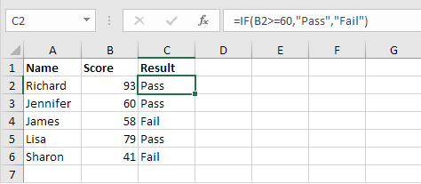
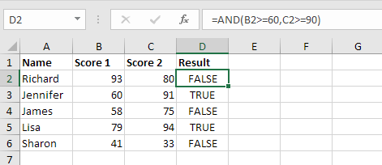
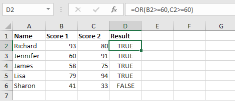
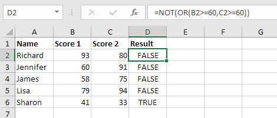
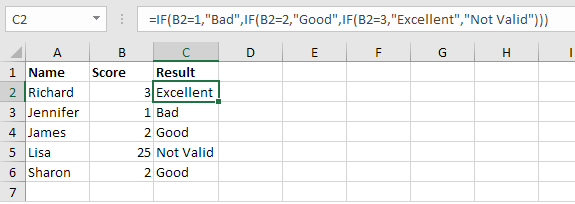
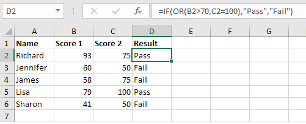
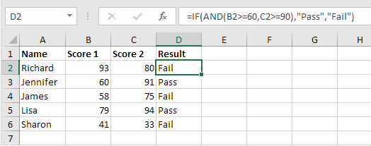
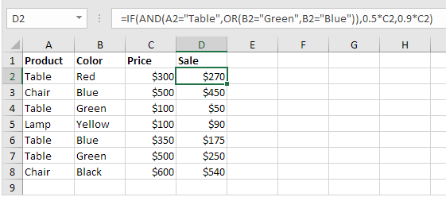

# Logical Function

### 1. IF

Suatu fungsi logic dalam excel, yang akan mengembalikan nilai True atau False.  
Rumus dalam excel :  
=IF\(Cell \(Kondisi\) , "Nilai jika kondisi bernilai True" , "Nilai jika kondisi bernilai False"\).

### 2. AND

Suatu fungsi dalam logic yang akan mengembalikan nilai True jika kedua kondisi benar. Dan akan mengembalikan nilai False jika salah satu atau kedua kondisi bernilai salah.  
Rumus dalam excel :  
=AND\(kondisi1 , kondisi2\)

### 3. OR

Suatu fungsi dalam logic yang akan mengembalikan nilai True jika salah satu kondisi benar. Jika kedua kondisi bernilai salah, maka akan mengembalikan nilai False.  
Rumus dalam excel :  
=OR\(kondisi1, kondisi2\)

### 4. NOT

Suatu fungsi dalam logic yang akan me-negasikan hasil dari suatu kondisi, jika suatu kondisi tersebut bernilai benar, maka dengan fungsi NOT akan mengembalikan nilai False. Juga sebaliknya, jika suatu kondisi bernilai salah, maka NOT akan mengembalikan nilai True.  
Rumus dalam excel:  
=NOT\(kondisi\)

### 5. Nested IF \(IF-IF\)

Suatu fungsi logic dalam excel, dimana terdapat logic di dalam logic \(IF di dalam IF\). Jika pada kondisi1 \(IF yang pertama\) bernilai benar, maka akan mengembalikan nilai True, Jika pada kondisi1 bernilai False maka masuk ke IF yang berikutnya \(kondisi2\). Jika pada kondisi2 \(IF kedua\) bernilai benar, maka akan mengembalikan nilai True pada kondisi itu, jika tidak maka akan mengembalikan nilai False.   
Rumus dalam excel :  
=IF\(kondisi1 , "Nilai jika True", IF\(Kondisi2 , "Nilai jika kondisi2 True" , " Nilai jika kondisi2 dan kondisi1 tidak terpenuhi"\)\)

### 6. IF-OR 

Suatu fungsi logic yang terdapat 2 kondisi dalam satu IF. Pada IF-OR ini akan mengembalikan nilai True jika salah satu kondisi terpenuhi.  
Rumus dalam Excel :   
=IF\(OR\(kondisi1 , kondisi2\), "Nilai jik True" , "Nilai jika False"\)

### 7. IF-AND

Suatu fungsi logic yang terdapat 2 kondisi dalam satu IF. Pada IF-AND ini akan mengembalikan nilai True jika kedua kondisi terpenuhi \(bernilai True\), jika salah satu atau keduanya bernilai salah, maka akan mengembalikan nilai False.  
Rumus dalam Excel :   
=IF\(AND\(kondisi1 , kondisi2\), "Nilai jika True" , "Nilai jika False"\)

### 8. IF-AND-OR

Suatu fungsi logic yang terdapat 3 atau lebih kondisi dalam satu IF. IF-AND-OR merupakan gabungan dari IF-AND dan IF-OR.  
Rumus dalam Excel :   
=IF\(AND\(kondisi1, OR\(kondisi2 , kondisi3\)\), "Nilai jika True" , "Nilai jika False"\)

