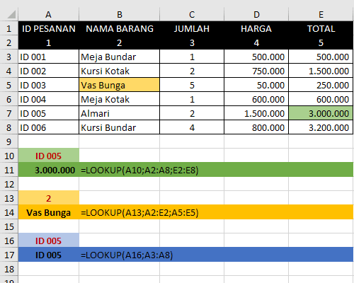
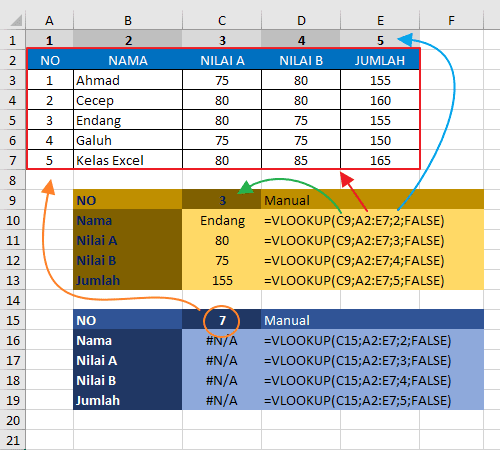
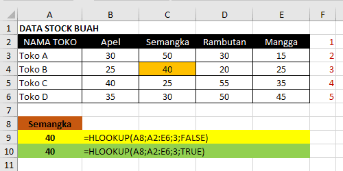

# LOOKUP and Reference Funtion

Formula Excel LOOKUP and Reference adalah dasar dari fungsi pencarian dan referensi pada Microsoft Excel. Functions digunakan untuk mengambil data dari suatu range referensi pada tabel lookup dengan melakukan pencocokan data sel. Ada beberapa fungsi yang termasuk ke dalam kategori ini :

### LOOKUP Function

Fungsi LOOKUP adalah fungsi pada excel yang bisa kita gunakan untuk mengisi data pada tabel berdasarkan data pada tabel lainnya atau tabel referensi tertentu dengan menggunakan suatu nilai kunci yang spesifik

Fungsi LOOKUP pada excel menghasilkan sebuah nilai baik dari satu baris maupun satu kolom sebuah range atau dari sebuah array. Fungsi LOOKUP memiliki dua varian. Yakni, LOOKUP dalam bentuk vektor dan LOOKUP dalam bentuk Array.  
  
Vektor merupakan sebuah range excel yang hanya terdiri dari satu baris atau satu kolom. Bentuk vektor LOOKUP mencari nilai dalam range satu baris atau satu kolom \(yang disebut vektor\) dan mengembalikan nilai dari posisi yang sama dalam rentang satu baris atau satu kolom yang kedua.

Berikut adalah syntax dan contoh penggunaan rumus LOOKUP pada Excel :

```text
LOOKUP(Lookup_value; Lookup_vector; [Result_vector])
```


  Keterangan Argumen Sintaks :

1. **Lookup\_value** : Merupakan nilai yang dicari LOOKUP pada vektor pertama. Lookup\_value bisa berupa angka, teks, nilai logika, nama range atau referensi yang merujuk ke sebuah nilai.
2. **Lookup\_vector** : Sebuah Range yang hanya berisi satu baris atau satu kolom. Nilai-nilai di dalam lookup\_vector dapat berupa teks, angka, atau nilai logika. Nilai-nilai dalam Lookup\_vector harus ditempatkan dalam urutan naik \(..., -2, -1, 0, 1, 2, ..., A-Z, FALSE, TRUE\). Jika tidak, LOOKUP mungkin tidak mengembalikan nilai yang tepat. Teks huruf besar dan huruf kecil sama saja.
3. **Result\_vector** : \(Opsional\) Sebuah Range lain yang berisi satu baris atau satu kolom. Ukurannya harus sama dengan Lookup\_vector.




```text
=LOOKUP(A10;A2:A8;E2:E8)
```

### VLOOKUP Function

Fungsi atau Rumus Excel VLOOKUP adalah salah satu fungsi Excel yang digunakan untuk mencari data pada kolom pertama sebuah tabel data, kemudian mengambil nilai dari sel mana pun di baris yang sama pada tabel data tersebut. Dengan rumus ini kita dapat mengisi data pada sebuah tabel berdasarkan data pada tabel referensi lain dengan menggunakan sebuah nilai kunci yang spesifik.  Awalan huruf "V" didepan kata Vlookup merupakan singkatan dari kata Vertical. Istilah vertikal ini merujuk pada bentuk tabel referensi yang digunakan, dimana header atau judul tabel terletak dibagian atas dan field datanya tersusun kebawah secara vertikal.

Berikut adalah syntax dan contoh penggunaan rumus VLOOKUP pada Excel :

```text
VLOOKUP(NilaiYangDiCari; TabelReferensi; NomorKolom; [RangeLookup])
```


Keterangan syntax :

**NilaiYangDiCari** : Merupakan nilai yang akan kita cari pada kolom pertama sebuah tabel atau kolom paling kanan dari TabelReferensi. Argument ini dapat berupa angka, teks, tanggal maupun nilai tertentu baik ditulis langsung maupun sebuah referensi sel. Bisa juga berupa nilai yang dihasilkan oleh rumus excel lainnya.

**TabelReferensi** : Sebuah tabel referensi data yang terdiri dari 2 kolom atau lebih, dimana NilaiYangDicari berada pada kolom pertama tabel data ini.

**NomorKolom** : Merupakan Nomor kolom dari argumen TabelReferensi yang mengandung nilai data dan akan kita ambil nilai yang sebaris dengan posisi NilaiYangDicari pada kolom pertama.

**RangeLookup** : Diisi dengan nilai Boolean **TRUE** atau **FALSE**. Nilai logika True/false ini menujukkan tipe pencarian. Nilai logika pada rumus Vlookup digunakan sebagai acuan untuk menetapkan apakah kita ingin VLOOKUP menemukan hasil yang sama persis atau cukup menemukan nilai mendekati.

* **TRUE**: Vlookup akan menemukan NilaiYangDiCari Pada TabelReferensi pencarian yang sama persis atau mendekati. Jika Nilai yang sama persis tidak ditemukan maka nilai terbesar berikutnya yang kurang dari NilaiYangDiCari yang akan dihasilkan.
* **FALSE**: Vlookup akan menemukan NilaiYangDiCari Pada TabelReferensi pencarian yang sama persis saja. Jika tidak ditemukan maka Vlookup akan menghasilkan pesan error \#NA!




```text
=VLOOKUP(C9;A2:E7;2;FALSE)
```

### HLOOKUP Function

Sebenarnya fungsi HLOOKUP sama dengan fungsi VLOOKUP yang membedakan adalah bentuk tabel dan letak value yang akan dicari. Rumus Excel Hlookup merupakan salah satu fungsi Excel yang digunakan untuk mencari data pada baris pertama sebuah tabel data, kemudian mengambil nilai dari sel mana pun di kolom yang sama pada tabel data tersebut.  
  
Jika value yang kita cari dengan Fungsi VLOOKUP ada pada kolom pertama sebuah tabel atau range dan nilai yang dihasilkan ada pada baris yang sama, maka pencarian dengan HLOOKUP ada pada baris pertama sebuah tabel atau range dan hasil yang dikembalikan ada pada kolom yang sama.  
  
Awalan huruf "H" didepan kata Hlookup merupakan singkatan dari kata Horizontal. Istilah horisontal ini merujuk pada bentuk tabel referensi yang digunakan, dimana header atau judul tabel terletak dibagian kiri dan field datanya tersusun samping secara horisontal.

Berikut adalah syntax dan contoh penggunaan rumus VLOOKUP pada Excel :

```text
HLOOKUP(NilaiYangDiCari; TabelReferensi; NomorBaris; [RangeLookup])
```


Fungsi HLOOKUP juga memiliki empat argumen:

  
**NilaiYangDiCari :** Nilai yang dicari pada baris pertama tabel. NilaiYangDiCari bisa berupa nilai, referensi, atau string teks.

**TabelReferensi :** Tabel data dimana NilaiYangDiCari akan di temukan pada baris pertamanya. Gunakan referensi ke sebuah range, tabel, nama range atau nama tabel.

**NomorBaris :** Nomor baris dalam TabelReferensi yang akan menghasilkan nilai yang cocok.

**RangeLookup :** Berisi TRUE atau FALSE. Nilai logika ini akan menentukan apakah kita ingin Hlookup mencari kecocokan yang sama persis atau kecocokan yang mendekati. Jika berisi TRUE atau dikosongkan \(tidak diisi\) maka Hlookup menghasilkan kecocokan yang mendekati. Jika FALSE, HLOOKUP akan menemukan kecocokan persis. Jika tidak ditemukan, akan menghasilkan nilai kesalahan \#N/A.




```text
=HLOOKUP(A8;A2:E6;3;FALSE)
```

### Index and Match


