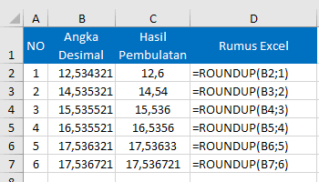

# ROUNDUP and ROUNDDOWN Function

Formula RoundUP dan RoundDOWN pada microsoft excel adalah salah satu bagian dari fungsi matematika dan trigonometri \(Math and Trigonometry Function\).

## ROUNDUP

 **Fungsi ROUNDUP** adalah fungsi excel yang digunakan untuk **membulatkan angka desimal ke atas** pada sejumlah digit tertentu.  Dengan fungsi RoundUp angka dibelakang koma akan selalu dibulatkan ke atas menjauhi angka 0.

 Pada rumus excel fungsi RoundUp megikuti aturan penulisan berikut:

Sintaks Fungsi : 

 `ROUNDUP(Angka; JumlahDigit)`

 Sama dengan fungsi ROUND, fungsi RoundUp memiliki dua argumen:  
  
`-`**Angka**Merupakan angka desimal atau pecahan yang ingin dibulatkan ke atas.

  **- JumlahDigit** Merupakan banyak digit pembulatan yang ingin di terapkan pada angka pembulatan desimal.

 Fungsi RoundUp dan Round sama-sama akan membulatkan angka. Hanya saja dengan fungsi RoundUp berapapun angka yang akan dibulatkan akan selalu dibulatkan ke atas.  

 Saat menggunakan fungsi atau rumus RoundUp untuk membulatkan angka, jika argumen **JumlahDigit bernilai 0**, maka angka dibulatkan ke atas ke bilangan bulat \(tanpa koma/desimal\) terdekat. Sehingga hasil akhirnya akan sama dengan fungsi ROUND excel.

 Apabila **JumlahDigit lebih kecil dari 0 atau bernilai negatif**, maka angka desimal tersebut akan dibulatkan ke atas ke sebelah kiri koma desimal.  
  

  Seperti yang terlihat pada contoh diatas dengan memberi nilai negatif tiga\(-3\) pada jumlah digit maka fungsi ini bisa juga digunakan untuk membulatkan angka pada kelipatan 1000 atau membulatkan bilangan ke puluhan terdekat kelipatan tertentu sesuai kebutuhan.

## ROUNDDOWN

 **Fungsi RoundDown** adalah fungsi excel yang digunakan untuk **membulatkan angka desimal ke bawah** pada signifikasi tertentu.  
  
Dengan fungsi roundDown angka desimal akan selalu dibulakan ke bawah mendekati angka 0 \(nol\).  
  

 Cara menggunakan fungsi RoundDown pada rumus excel adalah berikut:

Sintaks Fungsi

 `ROUNDDOWN(Angka; JumlahDigit)`

 Sama dengan fungsi ROUND dan RoundUp fungsi RoundDown juga memiliki dua argumen yang harus diisi saat digunakan untuk memebuat sebuah rumus excel:  
  
-**Angka**Merupakan angka desimal atau pecahan yang akan dibulatkan ke bawah.

**-JumlahDigit**Merupakan jumlah digit pembulatan yang akan di terapkan pada angka pembulatan.  
  
 Jika menggunakan rumus Rounddown dengan nilai **JumlahDigit lebih dari 0 \(nol\)** maka nilai desimal kan selalu dibulatkan ke bawah mendekati 0 \(nol\) sebanyak tempat desimal yang ditentukan.

 Jika **JumlahDigit adalah 0**, maka angka desimal akan dihilangkan. Fungsi RoundDown dalam hal ini akan membulatkan angka pecahan desimal ke bawah ke bilangan bulat terdekat.

 Jika **JumlahDigit bernilai negatif atau lebih kecil dari 0**, maka angka dibulatkan ke bawah ke sebelah kiri koma desimal.

 Setelah membaca tutorial rumus pembulatan angka desimal pada microsoft excel di atas, saya yakin Anda tidak bingung lagi memilih fungsi atau rumus excel mana yang lebih tepat untuk digunakan sesuai kebutuhan Anda masing-masing.  
  

