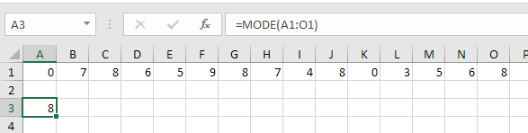

# Statistical Function

### 1. AVERAGE

Suatu fungsi dalam excel yang akan mengkalkulasikan nilai rata-rata dari cell yang dipilih.  
Rumus dalam excel :   
=AVERAGE\(cell1 : cell2\)

### 2. AVERAGE IF

Suatu fungsi dalam excel yang akan mengkalkulasikan nilai rata-rata dari cell yang dipilih, jika memenuhi syarat IF nya.  
Rumus dalam excel :   
=AVERAGEIF\(cell1 : cell2, "kondisi"\)

### 3. MEDIAN

Suatu fungsi dalam excel yang akan mengkalkulasi nilai tengah dari cell yang dipilih.  
Rumus dalam excel :   
=MEDIAN\(cell1 : cell2\)

### 4. MODE

Suatu fungsi dalam excel yang akan mencari nilai tengah \(Modus\) dari cell yang dipilih.  
Rumus dalam excel :   
=MODE\(cell1 : cell2\)

### 5. MIN

Suatu fungsi dalam excel yang akan mencari nilai minimum dari  cell yang dipilih.  
Rumus dalam excel :   
=MIN\(cell1 : cell2\)

### 6. MAX

Suatu fungsi dalam excel yang akan mencari nilai maksimum dari  cell yang dipilih.  
Rumus dalam excel :   
=MAX\(cell1 : cell2\)

### 7. LARGE

Suatu fungsi dalam excel yang akan mencari nilai terbesar ke-n dari  cell yang dipilih. Jadi dengan fungsi LARGE kita bisa mencari nilai terbesar ke-n \(ke-berapa\) yang kita inginkan.  
Rumus dalam excel :   
=LARGE\(cell1 : cell2, n\)

### 8. SMALL

Suatu fungsi dalam excel yang akan mencari nilai terkecil ke-n dari  cell yang dipilih. Jadi dengan fungsi SMALLkita bisa mencari nilai terbesar ke-n \(ke-berapa\) yang kita inginkan.  
Rumus dalam excel :   
=SMALL\(cell1 : cell2, n\)

### 9. ROUND

Suatu fungsi dalam excel yang akan membulatkan suatu nilai dalam cell. Selain itu dengan fungsi ROUND, kita juga bisa membulatkan suatu nilai ke-n decimal\(berapa angka dibelakang koma\).  
 Ketentuan pembulatannya adalah sebagai berikut :  
a. Nilai 0-4, akan dibulatkan kebawah  
b. Nilai 5-9 akan dibulatkan keatas  
Rumus dalam Excel :  
=ROUND \(cell , n\)

### 10. ROUND-UP

Suatu fungsi dalam excel yang akan membulatkan suatu nilai dalam cell. Selain itu dengan fungsi ROUNDUP, kita juga bisa membulatkan suatu nilai ke-n decimal\(berapa angka dibelakang koma\). Pembulatan dengan fungsi ROUNDUP akan dibulatkan keatas seluruhnya.  
Rumus dalam Excel :  
=ROUNDUP \(cell , n\)

### 11. ROUND-DOWN

Suatu fungsi dalam excel yang akan membulatkan suatu nilai dalam cell. Selain itu dengan fungsi ROUNDDOWN, kita juga bisa membulatkan suatu nilai ke-n decimal\(berapa angka dibelakang koma\). Pembulatan dengan fungsi ROUNDDOWN akan dibulatkan kebawah seluruhnya.  
Rumus dalam Excel :  
=ROUNDDOWN \(cell , n\)

